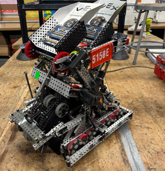
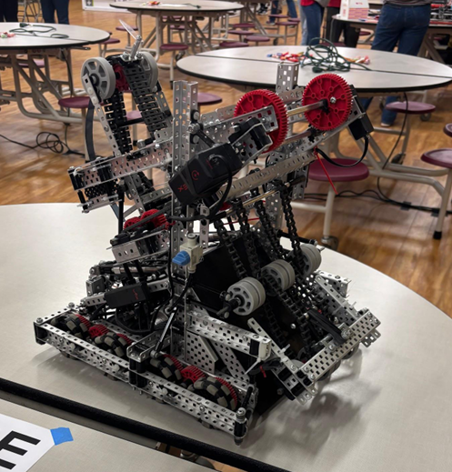
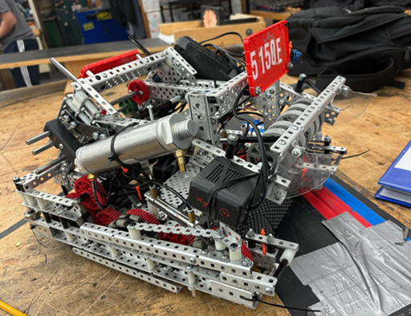

# 5150E High Stakes Robot Code

Competition software used by **Danbury Mad Hatters Envy (5150E)** during the 2024–25 VEX V5 Robotics Competition: **High Stakes** season.

This repository is a recruiting-focused snapshot of the robot code. It preserves the competition source largely as it was used during the season, including commented alternative autonomous sequences that were kept for rapid iteration at events.



This repository is shared for portfolio and code-review purposes. No license is granted for reuse, modification, or redistribution.

## My Role

I served as **Head Programmer & Builder** on 5150E and was the primary developer responsible for the robot-specific software, including autonomous routines, drivetrain and control tuning, sensor integration, subsystem automation, testing, and competition iteration.

This was a **team project**. The repository is shared to demonstrate my robotics programming work and does not imply that every line of the codebase was written solely by me.

## Technologies

- C++
- PROS for VEX V5
- LemLib
- VEX V5 motors, pneumatics, and sensors
- PID-based motion control
- IMU-based odometry/localization
- Concurrent RTOS tasks

## Technical Highlights

### Drivetrain and Autonomous Control

- Configured a LemLib drivetrain with separate lateral and angular PID controllers.
- Used IMU feedback and chassis odometry for autonomous translation, turning, and pose-based movement.
- Developed multiple autonomous routines for alliance color, starting position, elimination strategy, and skills runs.

### Sensor-Driven Subsystem Automation

- **Optical color sorting:** detected red/blue rings from RGB ratios and automatically rejected opposing-color rings.
- **Automatic intake recovery:** monitored intake torque and reversed the intake when a sustained jam was detected.
- **Mobile-goal acquisition:** used distance sensing to trigger the goal clamp and adjust approach behavior.
- **Lift positioning:** used rotation-sensor feedback for automated loading, scoring, and reset positions.

### Concurrent Robot Behavior

Several subsystem behaviors run as independent PROS tasks so sensing and mechanism control can continue while the drivetrain is moving.

Examples include:

- Ring detection and color sorting
- Goal clamping
- Intake jam recovery
- Lift control
- Sensor monitoring
- Telemetry display

## Design & Competition Iteration

The robot changed substantially throughout the season as we refined the intake, scoring mechanisms, sensor placement, and overall mechanical architecture.

Those changes directly affected the software. Autonomous paths, sensor thresholds, mechanism timing, and subsystem behaviors were repeatedly retuned as the physical robot evolved.



Competition development required tight iteration between the mechanical and software sides of the robot. As **Head Programmer & Builder**, I was involved in both, which made it possible to diagnose whether failures originated from software behavior, sensor configuration, mechanism geometry, or hardware reliability.

2023-2024 Season Robot:


## Repository Layout

```text
.
├── README.md
├── include/
│   └── main.h
├── src/
│   └── main.cpp
└── docs/
    └── CODE_GUIDE.md
